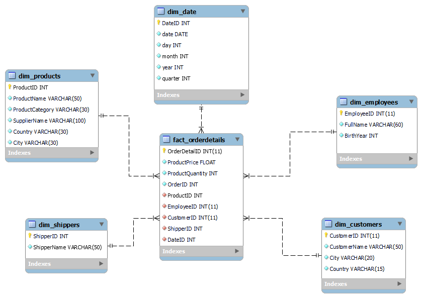

# ETL proces datasetu Northwind
<p>Tento repozitár obsahuje implementáciu ETL procesu v Snowflake pre analýzu dát z databázy <b>NorthWind</b>. Projekt sa zameriava na skúmanie obchodného správania zákazníkov a ich nákupných preferencií na základe údajov o objednávkach, produktoch a zákazníkoch. Výsledný dátový model umožňuje multidimenzionálnu analýzu a vizualizáciu kľúčových obchodných metrík.</p>
<hr>
<p>1. Úvod a popis zdrojových dát</p>
<p>
Cieľom semestrálneho projektu je analyzovať dáta týkajúce sa zákazníkov, produktov a objednávok. Táto analýza umožňuje identifikovať obchodné trendy, najpredávanejšie produkty a správanie zákazníkov.
</p>
<p>
Zdrojové dáta pochádzajú z Kaggle datasetu dostupného <a href="https://www.kaggle.com/datasets/cleveranjosqlik/csv-northwind-database">tu</a>. Dataset obsahuje sedem hlavných tabuliek:
</p>
<ul>
  <li><code>categories</code></li>
  <li><code>products</code></li>
  <li><code>suppliers</code></li>
  <li><code>orders</code></li>
  <li><code>shippers</code></li>
  <li><code>employees</code></li>
  <li><code>customers</code></li>
</ul>
<p>Účelom ETL procesu bolo tieto dáta pripraviť, transformovať a sprístupniť pre viacdimenzionálnu analýzu.</p>
<hr>
<h3>1.1 Dátová architektúra</h3>
<h3>ERD diagram</h3>
<p>Surové dáta sú usporiadané v relačnom modeli, ktorý je znázornený na <b>entitno-relačnom diagrame (ERD)</b>:</p>
<p align="center">
  
  <br>
  <em>Obrázok 1 Entitno-relačná schéma AmazonBooks</em>
</p>

---
## **2 Dimenzionálny model**

Navrhnutý bol **hviezdicový model (star schema)**, pre efektívnu analýzu kde centrálny bod predstavuje faktová tabuľka **`fact_orderdetails`**, ktorá  je prepojená s nasledujúcimi dimenziami:
- **`dim_products`**: Obsahuje podrobné informácie o produktoch (name, category, supplier, country, city).
- **`dim_shippers`**: Obsahuje údaje o zasielateľoch (shipper name).
- **`dim_employees`**: Obsahuje údaje o zamestnancoch (first name, last name, year of birth).
- **`dim_customers`**: Obsahuje demografické údaje o zákazníkoch (name, city, country).
- **`dim_date`**: Zahrňuje informácie o dátumoch objednavok (deň, mesiac, rok, štvrťrok).

Štruktúra hviezdicového modelu je znázornená na diagrame nižšie. Diagram ukazuje prepojenia medzi faktovou tabuľkou a dimenziami, čo zjednodušuje pochopenie a implementáciu modelu.

<p align="center">
  
  <br>
  <em>Obrázok 2 Schéma hviezdy pre AmazonBooks</em>
</p>

---
## **3. ETL proces v Snowflake**
ETL proces pozostával z troch hlavných fáz: `extrahovanie` (Extract), `transformácia` (Transform) a `načítanie` (Load). Tento proces bol implementovaný v Snowflake s cieľom pripraviť zdrojové dáta zo staging vrstvy do viacdimenzionálneho modelu vhodného na analýzu a vizualizáciu.

---
### **3.1 Extract (Extrahovanie dát)**

Dáta vo formáte .csv boli do Snowflake nahraté cez interné stage úložisko s názvom my_stage, ktoré bolo vytvorené pomocou:

```sql
CREATE OR REPLACE STAGE my_stage;
```

Odtiaľ boli importované do staging tabuliek pre jednotlivé entity, ako sú produkty, kategórie či dodávatelia, využitím príkazu COPY INTO. Príklad:

```sql
COPY INTO products_staging
FROM @my_stage/products.csv
FILE_FORMAT = (TYPE = 'CSV' FIELD_OPTIONALLY_ENCLOSED_BY = '"' SKIP_HEADER = 1);
```

---
### **3.2 Transform (Transformácia dát)**