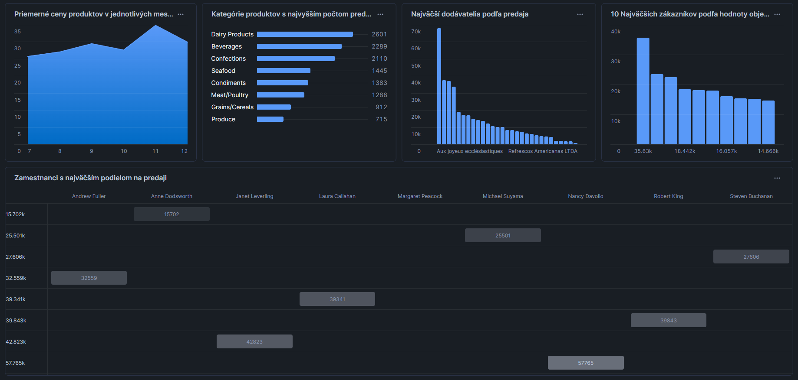
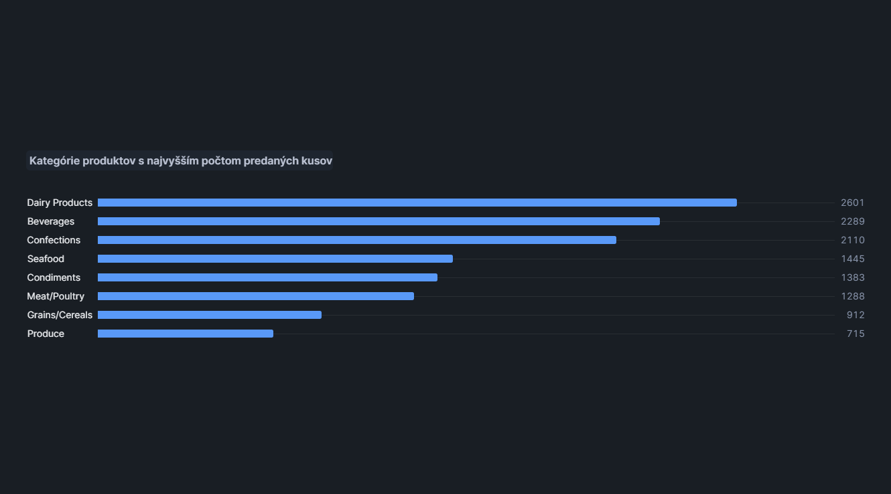
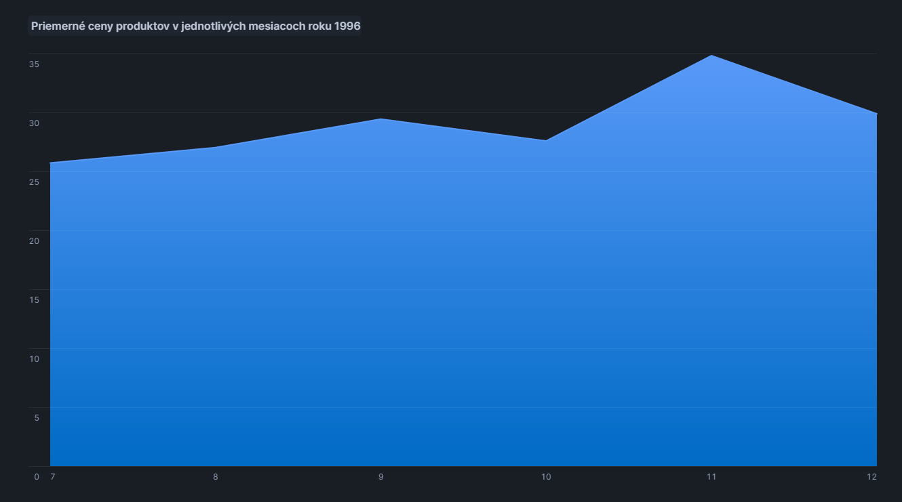
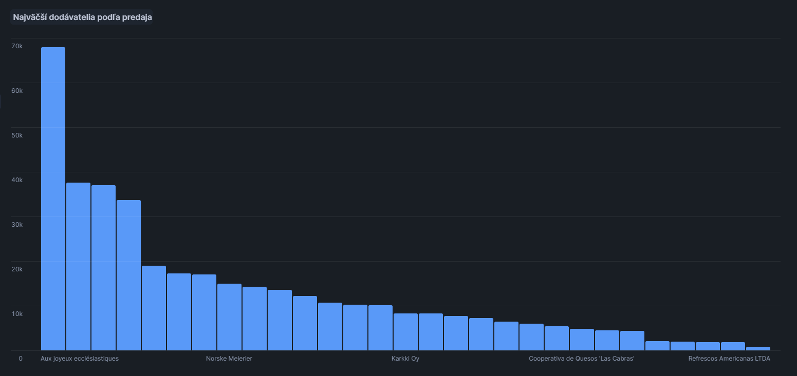
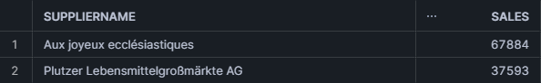
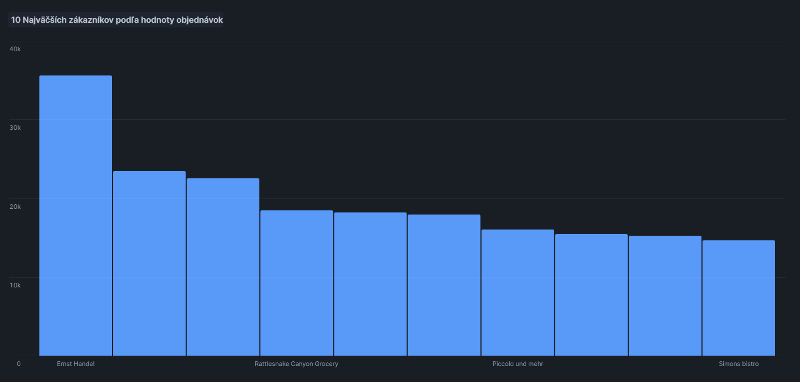
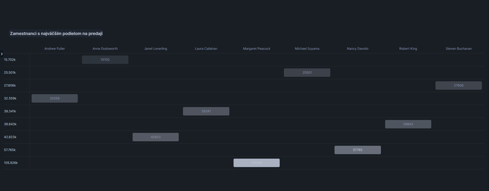

  # ETL proces datasetu Northwind
<p>Tento repozitár obsahuje implementáciu ETL procesu v Snowflake pre analýzu dát z databázy <b>NorthWind</b>. Projekt sa zameriava na skúmanie obchodného správania zákazníkov a ich nákupných preferencií na základe údajov o objednávkach, produktoch a zákazníkoch. Výsledný dátový model umožňuje multidimenzionálnu analýzu a vizualizáciu kľúčových obchodných metrík.</p>
<hr>
<p>1. Úvod a popis zdrojových dát</p>
<p>
Cieľom semestrálneho projektu je analyzovať dáta týkajúce sa zákazníkov, produktov a objednávok. Táto analýza umožňuje identifikovať obchodné trendy, najpredávanejšie produkty a správanie zákazníkov.
</p>
<p>
Zdrojové dáta pochádzajú z Kaggle datasetu dostupného <a href="https://www.kaggle.com/datasets/cleveranjosqlik/csv-northwind-database">tu</a>. Dataset obsahuje sedem hlavných tabuliek:
</p>
<ul>
  <li><code>categories</code></li>
  <li><code>products</code></li>
  <li><code>suppliers</code></li>
  <li><code>orders</code></li>
  <li><code>shippers</code></li>
  <li><code>employees</code></li>
  <li><code>customers</code></li>
</ul>
<p>Účelom ETL procesu bolo tieto dáta pripraviť, transformovať a sprístupniť pre viacdimenzionálnu analýzu.</p>
<hr>
<h3>1.1 Dátová architektúra</h3>
<h3>ERD diagram</h3>
<p>Surové dáta sú usporiadané v relačnom modeli, ktorý je znázornený na <b>entitno-relačnom diagrame (ERD)</b>:</p>
<p align="center">
  
  <br>
  <em>Obrázok 1 Entitno-relačná schéma AmazonBooks</em>
</p>

---
## **2 Dimenzionálny model**

Navrhnutý bol **hviezdicový model (star schema)**, pre efektívnu analýzu kde centrálny bod predstavuje faktová tabuľka **`fact_orderdetails`**, ktorá  je prepojená s nasledujúcimi dimenziami:
- **`dim_products`**: Obsahuje podrobné informácie o produktoch (name, category, supplier, country, city).
- **`dim_shippers`**: Obsahuje údaje o zasielateľoch (shipper name).
- **`dim_employees`**: Obsahuje údaje o zamestnancoch (first name, last name, year of birth).
- **`dim_customers`**: Obsahuje demografické údaje o zákazníkoch (name, city, country).
- **`dim_date`**: Zahrňuje informácie o dátumoch objednavok (deň, mesiac, rok, štvrťrok).

Štruktúra hviezdicového modelu je znázornená na diagrame nižšie. Diagram ukazuje prepojenia medzi faktovou tabuľkou a dimenziami, čo zjednodušuje pochopenie a implementáciu modelu.

<p align="center">
  
  <br>
  <em>Obrázok 2 Schéma hviezdy pre AmazonBooks</em>
</p>

---
## **3. ETL proces v Snowflake**
ETL proces pozostával z troch hlavných fáz: `extrahovanie` (Extract), `transformácia` (Transform) a `načítanie` (Load). Tento proces bol implementovaný v Snowflake s cieľom pripraviť zdrojové dáta zo staging vrstvy do viacdimenzionálneho modelu vhodného na analýzu a vizualizáciu.

---
### **3.1 Extract (Extrahovanie dát)**

Dáta vo formáte .csv boli do Snowflake nahraté cez interné stage úložisko s názvom my_stage, ktoré bolo vytvorené pomocou:

```sql
CREATE OR REPLACE STAGE my_stage;
```

Odtiaľ boli importované do staging tabuliek pre jednotlivé entity, ako sú produkty, kategórie či dodávatelia, využitím príkazu COPY INTO. Príklad:

```sql
COPY INTO products_staging
FROM @my_stage/products.csv
FILE_FORMAT = (TYPE = 'CSV' FIELD_OPTIONALLY_ENCLOSED_BY = '"' SKIP_HEADER = 1);
```

---
### **3.2 Transform (Transformácia dát)**

V tejto fáze boli dáta zo staging tabuliek vyčistené, transformované a obohatené. Hlavným cieľom bolo pripraviť dimenzie a faktovú tabuľku, ktoré umožnia jednoduchú a efektívnu analýzu.

### Vytváranie dimenzií**

`dim_products` bola vytvorená spojením tabuliek `products_staging`, `categories_s-+taging` a `suppliers_staging`, čo umožnilo denormalizáciu dát. Tabuľka obsahuje názvy produktov, kategórie, mená dodávateľov a ich lokality (krajina, mesto). Typ dimenzie: **SCD1**. Tento typ bol zvolený, pretože sa môžu meniť informácie o dodávateľoch (napr. názov firmy), pričom nie je potrebné uchovávať historické záznamy.
 ```sql
 CREATE TABLE dim_products AS
SELECT DISTINCT
    p.ProductID,
    p.ProductName,
    c.CategoryName AS ProductCategory,
    s.SupplierName,
    s.Country,
    s.City
FROM products_staging p
JOIN categories_staging c ON p.CategoryID = c.CategoryID
JOIN suppliers_staging s ON p.SupplierID = s.SupplierID;
```

`dim_shippers` obsahuje jedinečné informácie o zasielateľoch, vrátane ich identifikátorov a názvov. Pri transformacii tabulky `shippers_staging` bol vynechany stĺpec `phone`. Typ dimenzie: **SCD0**. Tento typ bol zvolený, pretože údaje o zasielateľoch, ako sú ich názvy, sa považujú za nemenné a nie je potrebné sledovať historické zmeny.
```sql
CREATE TABLE dim_shippers AS
SELECT DISTINCT
    s.ShipperID,
    s.ShipperName
FROM shippers_staging s;
```

`dim_employees` obsahuje údaje o zamestnancoch, ako sú ich mená, priezviská a rok narodenia. Pri transformacii tabulky `employees_staging` boli vynechané stĺpce `photo` a `note`. Typ dimenzie: **SCD1**. Tento typ bol zvolený, pretože údaje o zamestnancoch, ako sú mená, sa môžu meniť (napr. v prípade zmeny mena), ale historické záznamy nie sú potrebné.
```sql
CREATE TABLE dim_employees AS
SELECT DISTINCT
    e.EmployeeID,
    e.FirstName,
    e.LastName,
    YEAR(e.BirthDate) AS BirthYear
FROM employees_staging e;
```

`dim_customers` obsahuje informácie o zákazníkoch vrátane mena, mesta a krajiny. Typ dimenzie: **SCD1**. Tento typ bol zvolený, pretože údaje o zákazníkoch, ako sú názvy alebo miesta pobytu, sa môžu meniť, ale nie je potrebné uchovávať historické záznamy.
```sql
CREATE TABLE dim_customers AS 
SELECT DISTINCT
    c.CustomerID,
    c.CustomerName,
    c.City,
    c.Country
FROM customers_staging c;
```

`dim_date` obsahuje informácie o dátumoch, vrátane odvodených údajov, ako je deň, mesiac, rok a štvrťrok. Každý dátum má jedinečný DateID. Typ dimenzie: **SCD0**.
```sql
CREATE TABLE dim_date AS
SELECT DISTINCT
    ROW_NUMBER() OVER (ORDER BY CAST(OrderDate AS DATE)) AS DateID,
    CAST(OrderDate AS DATE) AS date,
    DATE_PART(year, OrderDate) AS year,
    DATE_PART(month, OrderDate) AS month,
    DATE_PART(day, OrderDate) AS day,
    DATE_PART(quarter, OrderDate) AS quarter   
FROM orders_staging
GROUP BY CAST(OrderDate AS DATE), 
    DATE_PART(day, OrderDate),  
    DATE_PART(month, OrderDate), 
    DATE_PART(year, OrderDate), 
    DATE_PART(quarter, OrderDate);
```

`fact_orderdetails` je faktová tabuľka, ktorá obsahuje informácie o objednávkach, ako sú ceny produktov, množstvo, a prepojenia na dimenzie: produkty, zamestnanci, zákazníci, zasielatelia a dátumy.
```sql
CREATE TABLE fact_orderdetails AS
SELECT
    od.OrderDetailID,
    ps.Price AS ProductPrice,
    od.Quantity AS ProductQuantity,
    od.OrderID,
    p.ProductID, 
    e.EmployeeID, 
    c.CustomerID, 
    s.ShipperID, 
    d.DateID
FROM orderdetails_staging od JOIN orders_staging o ON od.OrderID = o.OrderID
JOIN products_staging ps ON od.ProductID = ps.ProductID
JOIN dim_products p ON od.ProductID = p.ProductID
JOIN dim_employees e ON o.EmployeeID = e.EmployeeID
JOIN dim_customers c ON o.CustomerID = c.CustomerID
JOIN dim_shippers s ON o.ShipperID = s.ShipperID
JOIN dim_date d ON CAST(o.OrderDate as DATE) = d.date;
```

---
### **3.3 Load (Načítanie dát)**

Po úspešnom vytvorení dimenzií a faktovej tabuľky boli dáta nahraté do finálnej štruktúry. Na záver boli staging tabuľky odstránené, aby sa optimalizovalo využitie úložiska:
```sql
DROP TABLE IF EXISTS products_staging;
DROP TABLE IF EXISTS categories_staging;
DROP TABLE IF EXISTS suppliers_staging;
DROP TABLE IF EXISTS orders_staging;
DROP TABLE IF EXISTS shippers_staging;
DROP TABLE IF EXISTS employees_staging;
DROP TABLE IF EXISTS orderdetails_staging;
DROP TABLE IF EXISTS customers_staging;
```

ETL proces v Snowflake transformoval údaje z `.csv` formátu do hviezdicového modelu, ktorý zahŕňal čistenie, obohacovanie a reorganizáciu dát. Výsledný model umožňuje podrobnú analýzu predajov, objednávok a interakcií so zákazníkmi, čo slúži ako základ pre reporty a vizualizácie.

---
## **4 Vizualizácia dát**

# Bolo navrhnutých `5 vizualizácií`:
<p align="center">
  
  <br>
  <em>Obrázok 3 Dashboard Northwind datasetu</em>
</p>

---
### **Graf 1: Kategórie produktov s najvyšším počtom predaných kusov**

<p align="center">
  
  <em>Obrázok 4 Graf 1</em>
</p>

**Tento graf zobrazuje predané množstvo produktov podľa kategórií.**

```sql
SELECT p.ProductCategory, 
       SUM(od.ProductQuantity) AS quantity
FROM fact_orderdetails od
JOIN dim_products p ON od.ProductID = p.ProductID
GROUP BY p.ProductCategory
ORDER BY quantity DESC;
```

Z grafu vidíme, že najpredávanejšou kategóriou je  **Dairy Products** s *2601* predanými produktmi. Najmenšie množstvo produktov sa predalo v kategórii **Produce** - *715* kusov.

---
### **Graf 2: Priemerné ceny produktov v jednotlivých mesiacoch roku 1996**

<p align="center">
  
  <em>Obrázok 5 Graf 2</em>
</p>

**Tento graf zobrazuje predané množstvo produktov podľa kategórií.**

```sql
SELECT d.month, AVG(od.ProductPrice) AS price
FROM fact_orderdetails od
JOIN dim_date d ON od.DateID = d.DateID
WHERE d.year = '1996'
GROUP BY d.month
ORDER BY d.month;
```

Z údajov v grafe môžeme urobiť záver, že ceny tovarov ku koncu roka sa zvýšili. Najnižšia priemerná cena tovarov bola v **7.** mesiaci alebo v **júli** s hodnotou **25,7**. Najvyššia priemerná cena bola zaznamenaná v **12**. mesiaci - **decembri**, konkrétne **34,8**.

---
### **Graf 3: Najväčší dodávatelia podľa predaja**

<p align="center">
  
  <em>Obrázok 6 Graf 3</em>
</p>

**Zobrazuje dodávateľov zoradených podľa celkovej hodnoty tržieb.**

```sql
SELECT p.SupplierName, 
       SUM(od.ProductQuantity * od.ProductPrice) AS sales
FROM fact_orderdetails od
JOIN dim_products p ON od.ProductID = p.ProductID
GROUP BY p.SupplierName
ORDER BY sales DESC;
```

Z údajov v grafe môŽeme vidieť, že najväčším dodávateĺom `Aux joyeux ecclésiastiques`, ktorý veľmi dominuje nad ostatnými dodávateľmi na trhu:

<p align="center">
  
  <em>Obrázok 7 Údaje z Grafu 3.</em>
</p>

Z obrázku si môžeme všimnúť, že rozdiel v hodnote tržieb medzi najväčším a druhým najväčším dodavateľmi je **30291**. Najmenším dodávateľom je `Refrescos Americanas LTDA` z hodnotou **790**.

---
### **Graf 4: 10 Najväčších zákazníkov podľa hodnoty objednávok**

<p align="center">
  
  <em>Obrázok 8 Graf 4</em>
</p>

**Tento graf zobrazuje 10 zákazníkov s najvyššou celkovou cenou všetkých svojich objednávok.**

```sql
SELECT 
    c.CustomerName, 
    SUM(od.ProductQuantity * od.ProductPrice) AS sales
FROM fact_orderdetails od
JOIN dim_customers c ON od.CustomerID = c.CustomerID
GROUP BY c.CustomerID, c.CustomerName
ORDER BY sales DESC
LIMIT 10;
```

---
### **Graf 5: Zamestnanci s najväčším podielom na predaji**

<p align="center">
  
  <em>Obrázok 9 Graf 5</em>
</p>

**Graf zobrazuje tržby generované jednotlivými zamestnancami.**

```sql
SELECT 
    e.FullName AS EmployeeName,
    SUM(od.ProductQuantity * od.ProductPrice) AS sales
FROM fact_orderdetails od
JOIN dim_employees e ON od.EmployeeID = e.EmployeeID
GROUP BY e.EmployeeID, e.FullName
ORDER BY sales;
```

Graf umožňuje sledovať výkonnosť zamestnancov a na základe tejto informácie môžeme odhaliť, ktorí zamestnanci sú najúspešnejší. Najlepší pracovník za celý čas je `Margaret Peacock` s hodnotou tržieb **105926**.

---

**Autor:** Artem Ursaki